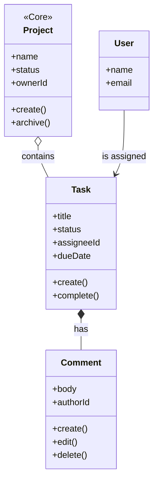

# Mermaid classDiagram 模板

当对象较多、关系较复杂时，用 Mermaid 的 `classDiagram` 表达对象、属性、动作与关系。

```mermaid
classDiagram
    class Project {
        <<Core>>
        +name
        +status
        +ownerId
        +create()
        +archive()
    }

    class Task {
        +title
        +status
        +assigneeId
        +dueDate
        +create()
        +complete()
    }

    class Comment {
        +body
        +authorId
        +create()
        +edit()
        +delete()
    }

    class User {
        +name
        +email
    }

    Project o-- Task : contains
    Task *-- Comment : has
    User --> Task : is assigned
```

常用关系符号：

- 关联：`-->`
- 聚合：`o--`
- 组件：`*--`
- 继承：`<|--`
